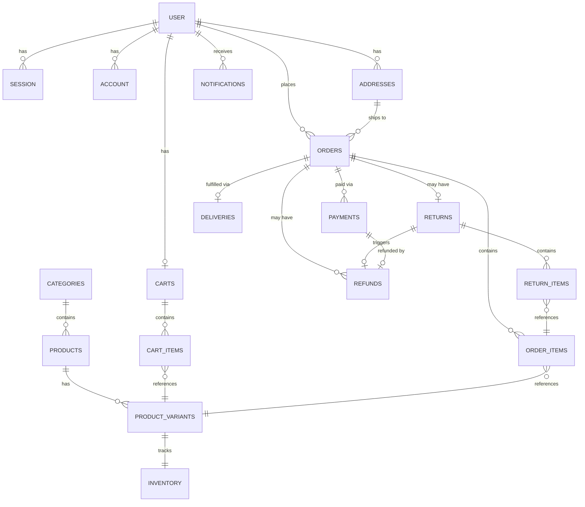

# Database Schema

Postgres (Neon, serverless), managed via Drizzle ORM. This document reflects the **target schema** — some tables below (`refunds`, `deliveries`, `returns`, `return_items`, `notifications`) are designed per the Operations & Business Flow Spec and are not yet implemented in code as of this writing.

## Entity Relationship Diagram

---

## Existing tables (implemented)

### `user` *(better-auth core + custom fields)*
| Column | Type | Notes |
|---|---|---|
| id | text | better-auth-generated UUID string — not native `uuid` |
| email | text, unique | |
| fullName | text | mapped from better-auth's core `name` |
| phone | text | |
| role | text | `customer` \| `admin`, default `customer`, `input: false` |
| emailVerified | boolean | |

### `session`, `account`, `verification`
better-auth standard tables — structure dictated by the library.

### `rate_limit`
| Column | Type | Notes |
|---|---|---|
| id | text | |
| key | text | |
| count | integer | |
| lastRequest | **bigint** | must be `bigint`, not `timestamp` — better-auth writes a raw ms number |

### `categories`
| Column | Type |
|---|---|
| id | uuid |
| name | varchar |
| slug | varchar, unique |

### `products`
| Column | Type | Notes |
|---|---|---|
| id | uuid | |
| categoryId | uuid, FK → categories | nullable |
| name | varchar | |
| description | text | nullable |
| basePrice | numeric(10,2) | |
| isActive | boolean | default `true` |

### `product_variants`
| Column | Type | Notes |
|---|---|---|
| id | uuid | |
| productId | uuid, FK → products, cascade delete | |
| size | varchar | |
| color | varchar | |
| priceOverride | numeric(10,2) | nullable |
| imageUrl | text | nullable |

Unique on `(productId, size, color)`.

### `inventory`
| Column | Type |
|---|---|
| id | uuid |
| variantId | uuid, FK → product_variants, unique |
| quantity | integer |
| lowStockThreshold | integer, default 5 |

### `addresses`
| Column | Type |
|---|---|
| id | uuid |
| userId | text, FK → user, cascade delete |
| region | varchar |
| city | varchar |
| landmarkOrGps | varchar, nullable |
| recipientPhone | varchar |
| isDefault | boolean |

### `carts`
| Column | Type |
|---|---|
| id | uuid |
| userId | text, FK → user, cascade delete, **unique** |
| createdAt | timestamp |

### `cart_items`
| Column | Type |
|---|---|
| id | uuid |
| cartId | uuid, FK → carts, cascade delete |
| variantId | uuid, FK → product_variants |
| quantity | integer, default 1 |

### `orders`
| Column | Type |
|---|---|
| id | uuid |
| userId | text, FK → user |
| addressId | uuid, FK → addresses |
| status | enum: `pending`, `paid`, `processing`, `shipped`, `delivered`, `cancelled` |
| totalAmount | numeric(10,2) |
| createdAt / updatedAt | timestamp |

### `order_items`
| Column | Type |
|---|---|
| id | uuid |
| orderId | uuid, FK → orders, cascade delete |
| variantId | uuid, FK → product_variants |
| productName, size, color | varchar — snapshotted at order time |
| unitPrice | numeric(10,2) — snapshotted at order time |
| quantity | integer |

### `payments` *(updated — manual payment support added)*
| Column | Type | Notes |
|---|---|---|
| id | uuid | |
| orderId | uuid, FK → orders, cascade delete | |
| provider | enum: `paystack`, `flutterwave`, **`manual`** | `manual` = business MoMo number, admin-confirmed |
| providerReference | varchar | nullable for manual payments |
| status | enum: `pending`, `success`, `failed` | |
| amount | numeric(10,2) | |
| **markedByAdminId** | text, FK → user, nullable | *new* — required when `provider = "manual"`; records which admin confirmed it |
| **markedAt** | timestamp, nullable | *new* — when the manual confirmation happened |
| **note** | text, nullable | *new* — optional admin note, e.g. a MoMo transaction reference, for record-keeping only |
| createdAt | timestamp | |

---

## New tables (per Operations & Business Flow Spec — not yet implemented)

### `deliveries` — one per order (1:1)
| Column | Type | Notes |
|---|---|---|
| id | uuid | |
| orderId | uuid, FK → orders, **unique** | enforces one delivery per order |
| provider | varchar, nullable | dispatch company name (e.g. "Shaq Express") — plain string, not an enum, since no provider is confirmed yet and this must stay pluggable |
| providerReference | varchar, nullable | the courier/tracking reference from the provider |
| status | enum: `requested`, `assigned`, `picked_up`, `en_route`, `delivered`, `failed` | |
| currentLat | numeric, nullable | reserved for a future provider that supports live location — unused today |
| currentLng | numeric, nullable | reserved, unused today |
| requestedAt | timestamp | when dispatch was requested |
| deliveredAt | timestamp, nullable | |
| failureReason | text, nullable | populated if status reaches `failed` |

A `deliveries.status = "delivered"` event is what advances `orders.status` to `delivered`.

### `returns` — one per order, ever (one-shot)
| Column | Type | Notes |
|---|---|---|
| id | uuid | |
| orderId | uuid, FK → orders, **unique** | enforces one return attempt per order, ever — a rejected return cannot be retried on the same order |
| status | enum: `return_requested`, `return_approved`, `return_rejected`, `return_received`, `return_rejected_on_inspection`, `refunded` | |
| reason | text, nullable | customer-provided, optional |
| rejectionReason | text, nullable | admin-provided; shown to the customer whenever status is `return_rejected` or `return_rejected_on_inspection` |
| requestedAt | timestamp | |
| decidedAt | timestamp, nullable | when admin approved/rejected the initial request |
| receivedAt | timestamp, nullable | when the physical item was confirmed received |
| inspectedAt | timestamp, nullable | when admin completed inspection |
| inspectedByAdminId | text, FK → user, nullable | |

Must be within 14 days of the order's `deliveredAt` (enforced at the application layer, not a DB constraint) for `return_requested` to be created at all.

### `return_items` — supports partial returns
| Column | Type | Notes |
|---|---|---|
| id | uuid | |
| returnId | uuid, FK → returns, cascade delete | |
| orderItemId | uuid, FK → order_items | links to the exact purchased item (price/size/color snapshot) |
| quantity | integer | how many units of this line item are being returned — may be less than the original `order_items.quantity` |

Included from day one so the schema supports partial returns even if the initial admin UI only offers "return everything."

### `refunds` — separate from `payments`
| Column | Type | Notes |
|---|---|---|
| id | uuid | |
| orderId | uuid, FK → orders | |
| returnId | uuid, FK → returns, nullable | set when the refund originated from a return; null when it's a direct cancellation refund |
| paymentId | uuid, FK → payments | the original payment being refunded |
| amount | numeric(10,2) | **excludes delivery fee** |
| status | enum: `initiated`, `completed`, `failed` | |
| paystackRefundReference | varchar, nullable | |
| initiatedByAdminId | text, FK → user | refunds are always admin-triggered, never automatic |
| initiatedAt | timestamp | |
| completedAt | timestamp, nullable | set once Paystack's webhook confirms completion |

### `notifications` — persisted, admin-facing
| Column | Type | Notes |
|---|---|---|
| id | uuid | |
| recipientAdminId | text, FK → user, nullable | null = broadcast to all admins; set = targeted to one admin |
| type | enum: `new_order`, `return_requested`, `delivery_failed` | extensible — add values as new notification-worthy events are identified |
| relatedOrderId | uuid, FK → orders, nullable | |
| relatedReturnId | uuid, FK → returns, nullable | |
| message | text | |
| isRead | boolean, default `false` | |
| createdAt | timestamp | |

---

## Notable schema decisions

- **`refunds` is separate from `payments`** — a payment and its refund are distinct financial events with independent timestamps and statuses; modeling them as one row with a mutated status would lose the audit trail of "what was originally paid" vs. "what was later returned."
- **`payments.provider = "manual"` requires `markedByAdminId` + `markedAt`** at the application layer — every manual payment confirmation is a trust-boundary action and must be attributable to a specific admin, same rigor as any other financial override.
- **`deliveries` and `returns` are both unique per `orderId`** — enforcing one delivery and one return-attempt-ever per order at the database level, matching the confirmed business rules (no split shipments, no repeat return attempts after rejection).
- **`return_items` exists even though v1 UI may only support whole-order returns** — cheaper to build the correct data model now than migrate later once real return records exist.
- **`deliveries.provider` is a plain string, not an enum** — no dispatch provider is confirmed yet; a string keeps the schema from needing a migration the moment a provider is chosen.
- **`deliveries.currentLat`/`currentLng` exist but are unused** — reserved for a future provider that exposes live location; today's UI only shows the status label.
- **`user.id` is `text`, not native `uuid`** — inherited from better-auth's `randomUUID()`-based ID generation; all FKs referencing `user.id` follow suit.
- **`rate_limit.lastRequest` is `bigint`, not `timestamp`** — required to match better-auth's internal write format.
- **`order_items` intentionally duplicates product/price data** rather than joining live — an order must reflect what was actually purchased, immune to later product edits.

## Open questions affecting this schema

- Confirmed dispatch provider — will determine whether `deliveries.provider` stays a free string or becomes an enum once a provider is locked in.
- Whether items rejected on inspection are shipped back to the customer (and at whose cost) — may need an additional status/column if a "return shipment" needs tracking of its own.
